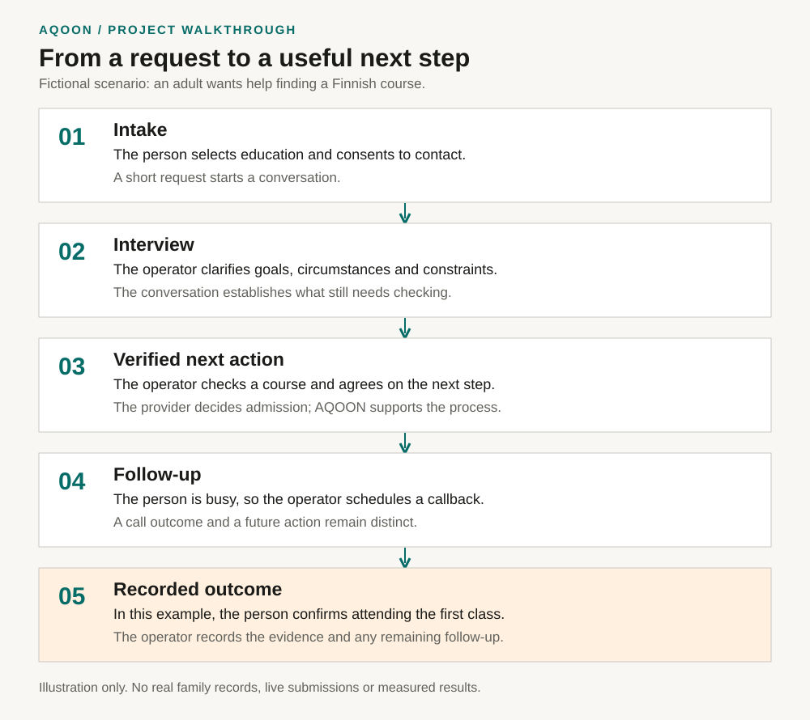

# AQOON: from a request to a useful next step

[Back to the project](../README.md) · [Public website](https://aqoon.live) · [Public customer case study](https://aqoon.live/tapaus)

I am Abducadir Aligure. I work directly with families and organisations, and use Claude Code to build the tools that support that work. This page shows the connection between customer needs, workflow decisions and inspectable code.

## A fictional example

An adult wants help finding a Finnish course but does not know where to begin. This example is entirely invented. It contains no family identity, contact details, production record or measured result. The diagram illustrates the workflow; it is not a screenshot of the tracker.



| Step | What happens in this example | What the implementation shows |
|---|---|---|
| 1. Intake | The person selects education and help learning Finnish, then consents to contact. The request starts a conversation. | [Intake UI](../caawi/index.html) and [routing/payload code](../caawi/app.js) |
| 2. Interview | The operator asks about the person's goal, current situation and practical constraints. A form selection alone does not establish eligibility. | [Interview contract](../tracker/interview-contract.js) and [field reference](architecture/interview-and-intake-field-reference.md) |
| 3. Verified next action | The operator checks a possible course with its provider and agrees on the next action with the person. | [Next-step workflow](../tracker/interview-next-steps.js) and [route research process](../workspaces/family-research/CONTEXT.md) |
| 4. Follow-up | The person is busy when called. The operator records that outcome and chooses a future callback time. | [Call outcome logic](../tracker/call-outcomes.js) and [regression tests](../tests/call-outcomes.test.js) |
| 5. Recorded outcome | In this fictional scenario, the person later confirms they attended their first class. The operator records what was verified and what still needs follow-up. | [Case lifecycle](../tracker/case-lifecycle.js) and [measurement definitions](../tracker/CONTEXT.md) |

The useful distinction is between asking for help, taking an action and reaching an outcome. A contact, interview or application is not automatically a successful service start. Current public evidence is described in the linked customer case study; the fictional example above makes no claim about actual results or available courses.

## Implementation example: protecting a form from repeat submissions

### Customer problem

When a form feels slow, a person may press Send again. Repeated requests can complicate the operator's queue and follow-up. The form needs predictable behaviour while a submission is in progress.

### Implemented decision

In [caawi/app.js](../caawi/app.js), `createSubmitGate` and `guardedSubmit` put a gate around the submission task. A second invocation using the same locked gate returns `{ skipped: true }` without starting a second task. A rejected task releases the gate so it can be retried. The form also disables its send controls while submitting.

The exported core functions can be tested without a browser or a live backend. That makes this part of the workflow inspectable even though the operator system is private.

### Reproduce the evidence

Run from the repository root with Node.js 22:

```sh
node --test --test-name-pattern="duplicate final request" tests/caawi.test.js
```

The test named **duplicate final request is blocked while first request is in flight** holds the first task open, attempts another submission and asserts that only one task ran. It then finishes the first task and checks the result. The full [intake test file](../tests/caawi.test.js) also covers payload construction, category routing and other behaviours.

This is evidence for a local submission gate. It is not proof of exactly-once processing across tabs, devices or server retries, and it does not replace browser and backend testing. The implementation and tests are the evidence here; no before-and-after reduction in duplicate records is claimed.

### What I take from it

A customer-facing workflow needs to account for uncertainty, waiting and repeat actions. Using AI to produce code is one part of the work. Defining the expected behaviour and checking it with a reproducible example is how I make that code useful to the person operating it.

## My role and use of AI

I bring the customer context from conversations, field research and paid client work. I use Claude Code to help implement and iterate on the software, and work through the resulting behaviour, issues and tests. The [AI coding workflow](../workspaces/ai-coding/CONTEXT.md) documents the sequence from task brief through implementation, evidence review and handoff. The [context workflow](architecture/context-workflow.md) explains how instructions and source evidence are kept separate.

This repository demonstrates a service platform developed with AI assistance. The separate AqoonPRO application explains Finnish letters in Somali and remains private; this showcase does not present its classifier, model routing or output checks as features of the public AQOON platform.

## Continue exploring

- [Business model](architecture/business-operating-model.md): the service and its intended value.
- [Repository map](architecture/repo-map.md): where the code and documentation live.
- [Tests](../tests/) and [CI workflow](../.github/workflows/site-qa.yml): repeatable checks, with current results in GitHub Actions.
- [Testing guidance](../TESTING-SUMMARY.md): static checks versus authenticated runtime verification.
- [Public case study](https://aqoon.live/tapaus): observed work and its stated limitations.
